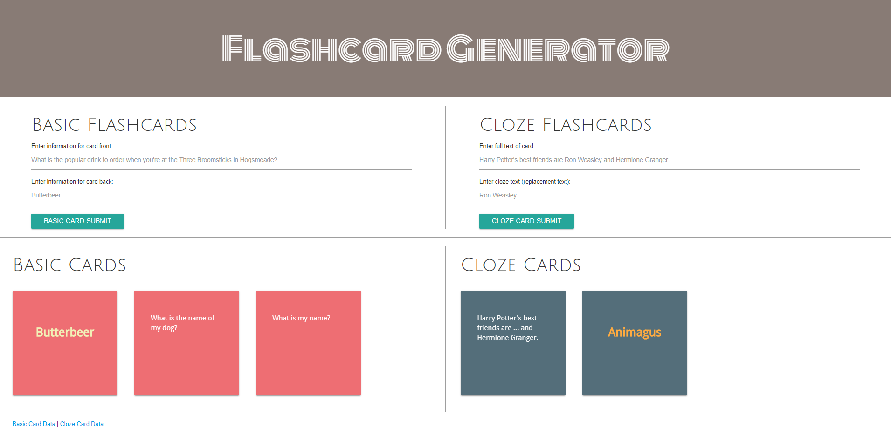

# flashcards-generator
Created a full stack application to generate flashcards. User is able to create two types of flashcards, basic and cloze. After submitting the information, the new flashcard is generated on the page and can be flipped back and forth. GET and POST requests are used to send information to and from the server.

View application here: https://flashcard-generator.herokuapp.com/

**Technology used:** Node.js, Express, jQuery, JavaScript, HTML, and CSS.

Below is a screenshot of the application:
